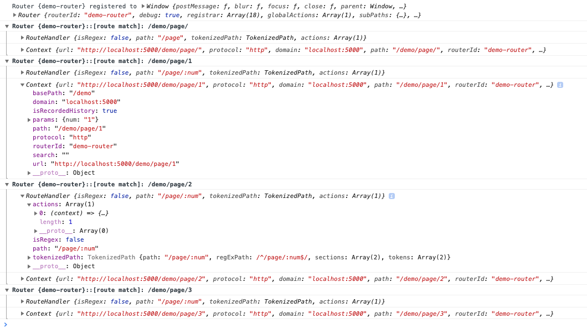

# 🐉 Dragon Router

[](https://travis-ci.com/kyle-west/dragon-router/branches)
[](https://www.npmjs.com/package/dragon-router)
[](https://www.npmjs.com/package/dragon-router)

Dragon Router is an ExpressJS-like client side router built from the ground up 
on [debuggability](#debugging) and [simplicity](#derived-subpaths).

It uses the browser's `history` API to control the pushing and popping of page navigation;
overwriting the need for a full page refresh on user navigation. Add it to your project with NPM:

```sh
npm install --save dragon-router
```

### Try the demo: 

[](https://codesandbox.io/s/dragon-router-demo-7os1x?fontsize=14&hidenavigation=1&theme=dark)

# Setup and usage

### ES6

`Router` is an es6 class. Import it like you would any other module. After 
setting up your routes (See [below](#route-matching)), register the router on the
window. 

```js
import { Router } from 'dragon-router';
const router = new Router();

... // add routing rules here

router.registerOn(window);
router.start() // run this function after you have established routing rules, so that the router knows it should immediately apply them
```

### CommonJS

If you are using CommonJS, you may import the proper version from the `/dist` folder.

```js
const { Router } = require('dragon-router/dist/dragon-router.min.js')
```

### Native Browser Sourcing

Likewise, you can include it in your HTML from a `script` tag.

```html
<!-- Globally Registered -->
<script src="/path/to/dragon-router/dist/dragon-router.min.js"></script>

OR

<!-- ES6 Module Imports -->
<script type="module" src="/path/to/dragon-router/dist/dragon-router.module.js"></script>
```

## Options

```js
let options = {
  basePath: '/my-app/base/route',    // mount the router off of a specific path     [default is '/']
  routerId: 'my-cool-dragon-router', // unique identifier between apps              [default is a random number]
  registerOn: window,                // bind to the client's browser immediately    [if not given, `router.registerOn(...)` must be called separately]
  debug: true                        // show additional logging info                [default is false]
}

const router = new Router(options);
```

# `Router.use()`

The `.use()` method allows us to apply matchers or behaviors to the routing. 

## Route matching

Route matching follows a similar pattern as Express. You can match with literal paths
or parameterized paths (which populate the `Context` with parameters).

```js
// render a page on a literal path matching
router.use('/about', renderYourAboutPageCB);
```

```js
router.use('/:section/:subSection', (context) => {
  
  // prefixing a path section with ':' will name that section in `context.params` 
  let section = context.params.section;
  let subSection = context.params.subSection;

  // now you can use the grepped data to apply on your app.
  renderYourPageCB(section, subSection);

});
```

You can append a parameter declaration with `(` `)` to specify a regex pattern
to enforce a match.

```js
router.use('/:section(home|about)/:subSection', (context) => {

  // now, the path will only ever match if the `section` is 'home' or 'about'
  let section = context.params.section;
  
  ...
});
```

Additionally, you may apply an array of matchers to a given handler.

```js
router.use(['/home/:subSection', '/about/:subSection'], (context) => {
  // your code here
});
```

Full `RegExp` matchers are also supported. _(Note that these do not get parameterized, unlike the string matchers mentioned above)_

```js
router.use(/^\/some\/fancy\/regular\/expression$/, (context) => {
  // your code here
});
```


### Optional Subpaths

Additional syntax of matchers includes `*` and `?` postfixes to sections.

The `*` postfix (e.g. `/your/route*`) will match any incoming route that is 
prefixed with the text before the `*` character.

The `?` postfix (e.g. `/your/:route?`) allows that section of the route to be 
optional. If you want to have the router automatically populate an optional section 
with data, see [Derived Subpaths](#derived-subpaths) below.


## Derived Subpaths

A `DerivedSubpath` allows for a route to specify default values for an optional path.
These are derived from a given callback. The callback for the DerivedSubpath can return 
an `async` object or a `String`. This is especially useful for automatically redirecting 
to fully qualified paths in your app. 

Here is an example:

```js
let defaultSection = new DerivedSubpath('section', (context) => {
  return 'main'; // or whatever you need to do to compute the default `section`
})
router.use(defaultSection);

...

// prefixing a parameter with '$' tells the router we want to use a DerivedSubpath
router.use('/page/$:section(main|about|contact)', renderPageSectionCB)
```

In this example, the `section` parameter will always be defined when `renderPageSectionCB` is ran.
If the user goes to `/page`, they will be redirected to `/page/main` by the router.

By this principle, the following two blocks are functionally equivalent:

```js
router.use('/page', (context) => {
  router.redirect(`/page/main`);
})
router.use('/page/:section(main|about|contact)', (context) => {
  router.redirect(`/page/${context.params.section}/default`);
});
router.use('/page/:section(main|about|contact)/:subsection(default|other)', renderPageCB);
```

and 

```js
router.use(new DerivedSubpath('section', () => 'main'));
router.use(new DerivedSubpath('subsection', () => 'default'));
router.use('/page/$:section(main|about|contact)/$:subsection(default|other)', renderPageCB);
```

The latter being easier for the developer to hold in their mental model of the routing.

## Middleware

Middleware is a pipeline of functions that get applied when a matching route is 
rendered. A middleware function takes two parameters, `context`, and `next`. The `next`
argument is a callback that invokes the next middleware in the pipeline. Naturally, 
`next()` should not be called in the last function of the pipeline.

```js
let loggingMiddleware = (context, next) => {
  console.log('[Router]: navigating to ', context.path)
  next(); 
}

...

router.use('/:view', loggingMiddleware, renderYourViewCB);
```

Alternatively, functions that are given to `Router.use(...)` without a matcher are 
treated as global middleware, and ran for every route.

```js
router.use(loggingMiddleware);
router.use(someOtherMiddleware1, someOtherMiddleware2); // accepts multiple middleware in one `use` statement
```


## `RouteHandler`

If you wish to make a particular handler reusable, you may form it as a `RouteHandler` for your convenience.

The constructor of `RouteHandler` takes two arguments: 
- [Matchers](#route-matching)
- And array of [middleware handlers](#middleware)

```js
let handler = new RouteHandler('/demo', [middleware1, middleware2, (context) => {
  // your handle here
}]);

router.use(handler);
```

# Removing the Router

In the event that you wish to remove the router from your application, you will need to first unregister it before deleting. 

```js
router.unregister()
router = undefined; // or whatever your flavor of deleting objects in JS
```

# Debugging

Dragon Router was built with debuggability in mind. In the console, you have access 
to valuable information that can help you understand what the router is doing.

```
> window.attachedRouter
```
This feature allows us to poke into the internals of the router and understand 
information about the callback `registrar` and what paths are handled by which callbacks.


Additionally, when you add the option `{ debug: true }` to the router, we get helpful output from the 
router live as the user navigates around the page.

```js
const router = new Router({ debug: true });
```




# Using with ReactJS

With [Hooks](https://reactjs.org/docs/hooks-intro.html), integration into ReactJS is pretty simple. Below is an example on how to do so.

```jsx
// Import our router and the pages we want to client render
import React from 'react'
import { Router } from 'dragon-router'
import { DefaultPage, ExamplePage } from '../my-client-rendered-pages'

// This function sets up the router to select a page to render based off of the current path
function attachRouter (updatePage) {
  return () => {
    const router = new Router({ registerOn: window })
    
    // set up routing rules
    router.use('/example', ctx => updatePage(<ExamplePage context={ctx} />))
    router.use('*', ctx => updatePage(<DefaultPage context={ctx} />))
    router.start()

    // cleanup callback
    return () => router.unregister()
  }
}

// Now our app conditionally renders pages based off of the route we are on
export default function App ({}) {
  const [page, updatePage] = React.useState(<DefaultPage />)
  React.useEffect(attachRouter(updatePage), [])

  return <div>{page}</div>
}
```
